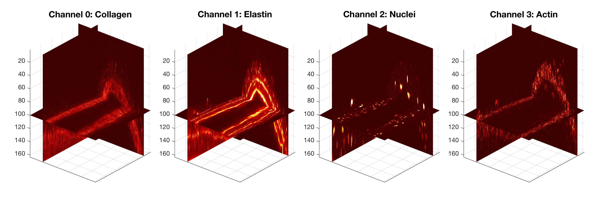
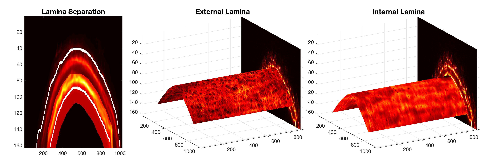

# Arterial-Fenestrae
Segmentation of Fenestrae from Internal Lamina of Arteries

<h1>Manual to use the fenestrae analysis</h1><!--introduction-->

To use the Matlab functions, the first requirement is that the ALL the images are saved in one folder (say images) and then a subfolder  for each channel of the data with the following order:
<pre>   channel0 - YELLOW = Phalloidin staining of ACTIN fibers')
   channel1 - RED    = Alexa staining of ELASTIN')
   channel2 - BLUE   = DAPI nuclei')
   channel3 - GREEN  = Second harmonic imaging of COLLAGEN')</pre>

When you have several experiments, you can save each experiment in a folder, that is all the
folders of the channels per separate folders, e.g. images/channel0, images/channel1,
images/channel2, ... images2/channel0, images2/channel1, etc.

Then, you need to save the Matlab functions in any working folder, for instance, the same folder
where you will have the folders for the data.

<h2>Unwrapping of the arteries</h2>

The first part of the algorithm consist of the unwrapping of the artery, selection of the lamina,
either Internal or External Lamina:

<pre class="codeinput">
 UnwrappedArtery = unwrap3DArtery('Experiment1/Channel1', method , ExternalInternal);
</pre>

The data sets were thus aligned by rotating the data along the "z" axis (rotation of original images)
and then a rotation along the "y" axis (axis perpendicular to the direction of the vessel). Once the
vessel was oriented as close as possible to a cylinder aligned with the "x" axis, the maximum intensity
projection over this axis was calculated. This calculation removed the variation along the "yz" planes.

<h2>Segmentation of the Fenestrae</h2>

Segmentation of the Laminae. To determine the edges of the artery, a multiscale calculation of
the Canny edges was performed by increasing the variance of the Gaussian until an asymptotic number
of edges, ideally one for each side of the artery, was reached. When the top of the artery was too close
to the edge of the field of view the asymptotic number was 3. The external edge presented considerable
variability due to the nature of the EEL, therefore the segmentation of IEL was obtained from the dilation
of the internal edge. To select the EEL, the dilated region was used to remove the intensity of the IEL.

The detection of the fenestra is done like this:

<pre class="codeinput">
[fenestrae,statsFenestrae] = fenestraeDetection(img0, method, post_processing,thresSeg,sizeLOG)
</pre>

<h2>Matlab Files</h2>

<pre class="codeinput">
fenestraeDetection.m
 
unwrap3DArtery.m
</pre>
